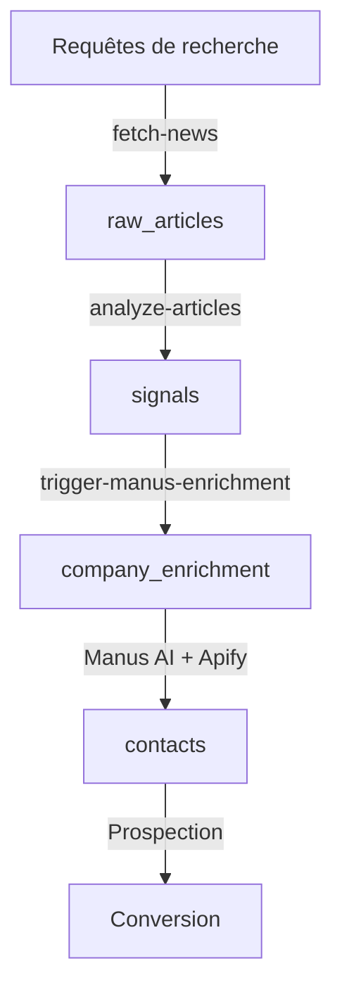
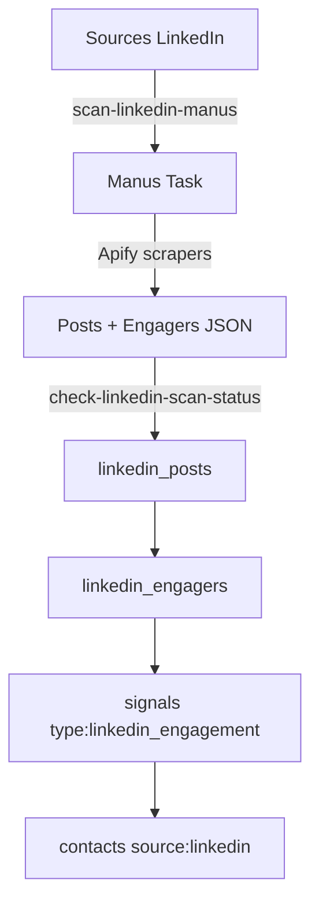
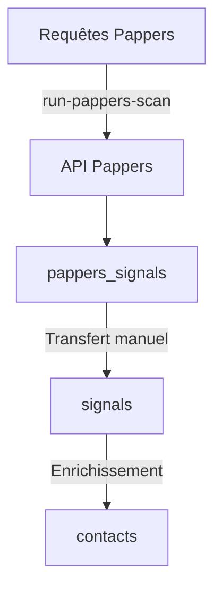

# GOURЯMET - Documentation Complète

## Plateforme de Veille Commerciale B2B

---

# Table des matières

1. [Vue d'ensemble](#1-vue-densemble)
2. [Architecture Technique](#2-architecture-technique)
3. [Fonctionnalités par Module](#3-fonctionnalités-par-module)
4. [Processus & Workflows](#4-processus--workflows)
5. [Design System](#5-design-system)
6. [APIs & Intégrations](#6-apis--intégrations)
7. [Base de données](#7-base-de-données)

---

# 1. Vue d'ensemble

## Mission
GOURЯMET est une plateforme de veille commerciale B2B qui détecte automatiquement des opportunités business via 3 sources principales :
- **Presse** : Analyse d'articles pour identifier des événements commerciaux
- **Pappers** : Données légales (anniversaires d'entreprises, nominations, levées de fonds)
- **LinkedIn** : Engagement sur posts pour identifier des prospects qualifiés

## Proposition de valeur
- Détection automatique de signaux d'achat
- Enrichissement de contacts (emails, téléphones, profils LinkedIn)
- Pipeline unifié de prospection
- Suivi du CRM événementiel

---

# 2. Architecture Technique

## Stack Technologique

| Composant | Technologie |
|-----------|-------------|
| Frontend | React 18 + TypeScript + Vite |
| Styling | Tailwind CSS + shadcn/ui |
| State Management | TanStack React Query |
| Routing | React Router DOM v6 |
| Backend | Supabase (Lovable Cloud) |
| Edge Functions | Deno (Supabase Functions) |
| IA | Manus AI Agent |
| Scraping | Apify Actors |
| Données légales | API Pappers |

## Structure des Fichiers

```
src/
├── pages/              # Pages principales
│   ├── Dashboard.tsx           # Dashboard global
│   ├── SignalsPresseDashboard.tsx
│   ├── SignalsPresseList.tsx
│   ├── SignalDetail.tsx
│   ├── PappersDashboard.tsx
│   ├── PappersQueries.tsx
│   ├── LinkedInDashboard.tsx
│   ├── LinkedInEngagers.tsx
│   ├── ContactsList.tsx
│   ├── EventsCalendar.tsx
│   ├── EventDetail.tsx
│   ├── EventForm.tsx
│   └── Settings.tsx
├── components/         # Composants réutilisables
├── hooks/              # Hooks React Query
├── types/              # Types TypeScript
└── integrations/       # Client Supabase

supabase/
└── functions/          # Edge Functions
    ├── scan-linkedin-manus/
    ├── check-linkedin-scan-status/
    ├── fetch-news/
    ├── analyze-articles/
    ├── run-pappers-scan/
    ├── trigger-manus-enrichment/
    └── generate-message/
```

---

# 3. Fonctionnalités par Module

## 3.1 Dashboard Global (`/`)

### Description
Vue d'ensemble consolidée de toute l'activité de veille commerciale.

### KPIs affichés
| KPI | Description |
|-----|-------------|
| Signaux totaux | Somme des signaux Presse + Pappers + LinkedIn |
| Contacts enrichis | Total des contacts avec données complètes |
| Taux conversion | % de contacts convertis / total |
| Actions aujourd'hui | Enrichissements + nouveaux contacts du jour |

### Sources de signaux
- **Presse** : Signaux issus de l'analyse d'articles
- **Pappers** : Signaux issus des données légales
- **LinkedIn** : Engagers identifiés sur les posts surveillés

### Pipeline Global
Entonnoir de conversion :
1. Contacts totaux
2. Contactés (LinkedIn ou Email envoyé)
3. Ont répondu
4. RDV obtenus
5. Convertis

### Outputs
- Navigation vers chaque source de signaux
- Accès aux événements et contacts

---

## 3.2 Signaux Presse (`/signals`)

### Description
Détection d'opportunités via l'analyse automatique d'articles de presse.

### Processus
1. **Fetch News** : Récupération d'articles via NewsAPI
2. **Analyze Articles** : Analyse IA (GPT/Gemini) pour extraire les signaux
3. **Création Signal** : Enregistrement avec score et type

### Types de signaux détectés
| Type | Emoji | Description |
|------|-------|-------------|
| Anniversaire | 🎂 | Anniversaire d'entreprise significatif |
| Levée de fonds | 💰 | Levée de fonds, investissement |
| Fusion/Acquisition | 🤝 | M&A, rapprochement |
| Distinction | 🏆 | Prix, récompense, certification |
| Expansion | 🏢 | Ouverture, agrandissement |
| Nomination | 👔 | Nouveau dirigeant, promotion |

### Workflow
```
[Requêtes de recherche] 
    → fetch-news (NewsAPI)
    → raw_articles (stockage)
    → analyze-articles (IA)
    → signals (création)
```

### Outputs
- Liste de signaux avec scores (1-5)
- Accès au détail du signal
- Lancement de l'enrichissement Manus

---

## 3.3 Signaux Pappers (`/pappers`)

### Description
Détection de leads via l'API Pappers (données légales françaises).

### Types de signaux
| Type | Description |
|------|-------------|
| Anniversaire | Entreprise qui fête X années (5, 10, 15...) |
| Nomination | Nouveau dirigeant enregistré |
| Levée de fonds | Augmentation de capital |
| Déménagement | Changement de siège social |
| Création | Nouvelle entreprise créée |

### Workflow
```
[Requêtes configurées]
    → run-pappers-scan (API Pappers)
    → pappers_signals (stockage)
    → Transfert vers signals (optionnel)
```

### Outputs
- Liste de signaux Pappers avec score de pertinence
- Données entreprise (effectif, ville, SIREN)
- Bouton de transfert vers le pipeline principal

---

## 3.4 Signaux LinkedIn (`/engagers`)

### Description
Identification de prospects via les engagements sur posts LinkedIn.

### Sources surveillées
- **Profils personnels** : Posts de dirigeants, influenceurs
- **Pages entreprises** : Posts corporate

### Types d'engagement
| Type | Score | Description |
|------|-------|-------------|
| Commentaire | 80 | Engagement fort, intention claire |
| Partage | 75 | Engagement moyen |
| Like | 70 | Engagement faible |

### Workflow Manus (orchestration complète)
```
[Sources LinkedIn actives]
    → scan-linkedin-manus (Manus AI)
        → Apify: linkedin-profile-posts
        → Apify: linkedin-post-reactions
        → Enrichissement profils
    → check-linkedin-scan-status (polling)
    → linkedin_engagers + signals + contacts
```

### Outputs
- **Engagers** : Liste des personnes ayant interagi
- **Signaux** : "Post Patrick" avec détail "Like de Jean Dupont (Acme Corp)"
- **Contacts** : Création automatique dans la liste globale

---

## 3.5 Tous les Contacts (`/contacts`)

### Description
Liste unifiée de tous les contacts enrichis, toutes sources confondues.

### Sources de contacts
| Source | Badge | Description |
|--------|-------|-------------|
| Presse | 🟣 | Contacts issus de l'enrichissement Manus sur signaux presse |
| Pappers | 🔵 | Contacts issus des données Pappers |
| LinkedIn | 🔷 | Contacts issus des engagers LinkedIn |

### Statuts de prospection
| Statut | Description |
|--------|-------------|
| Nouveau | Contact non encore contacté |
| LinkedIn envoyé | Message LinkedIn envoyé |
| Email envoyé | Email envoyé |
| A répondu | Le contact a répondu |
| RDV planifié | Rendez-vous confirmé |
| Converti | Client gagné |
| Pas intéressé | Refus ou non pertinent |

### Filtres disponibles
- Par source (Presse, Pappers, LinkedIn, Tous)
- Par statut de prospection
- Par date (7j, 30j, 3 mois, 6 mois)
- Par localisation
- Recherche textuelle

### Outputs
- Export CSV de la liste filtrée
- Accès au signal source de chaque contact
- Modification du statut de prospection

---

## 3.6 CRM Événements (`/events`)

### Description
Gestion des événements physiques (salons, conférences) pour la prospection.

### Fonctionnalités
- **Calendrier** : Vue des événements à venir
- **Scanner** : Détection automatique d'événements via veille web
- **Fiches événement** : Détails + liste de contacts associés

### Workflow
```
[Scanner événements]
    → detected_events (suggestions)
    → Validation manuelle
    → events (événements suivis)
    → event_contacts (contacts collectés)
```

### Outputs
- Liste des événements avec contacts_count
- Contacts spécifiques à chaque événement
- Statuts : Planifié, Confirmé, Passé

---

## 3.7 Enrichissement Manus

### Description
Agent IA (Manus) qui enrichit les signaux en trouvant les contacts décisionnaires.

### Processus
1. Signal détecté (Presse ou Pappers)
2. Clic sur "Enrichir" ou enrichissement automatique
3. Manus orchestre des scrapers Apify :
   - Recherche LinkedIn Sales Navigator
   - Profil LinkedIn détaillé
   - Recherche email (RocketReach, patterns)
4. Création des contacts enrichis

### Données collectées
| Champ | Description |
|-------|-------------|
| full_name | Nom complet |
| job_title | Poste actuel |
| email_principal | Email professionnel |
| linkedin_url | Profil LinkedIn |
| phone | Téléphone (si trouvé) |
| location | Localisation |

---

# 4. Processus & Workflows

## 4.1 Workflow Presse Complet



## 4.2 Workflow LinkedIn Complet



## 4.3 Workflow Pappers



---

# 5. Design System

## 5.1 Palette de Couleurs

### Mode Clair (Light Mode)

```css
:root {
  /* Background */
  --background: 40 20% 98%;        /* Crème légère */
  --foreground: 30 10% 15%;        /* Charbon foncé */

  /* Primary - Or Gourrmet */
  --primary: 38 55% 55%;           /* Or doré */
  --primary-foreground: 0 0% 100%; /* Blanc */

  /* Sidebar - Charbon sombre */
  --sidebar-background: 30 10% 12%;
  --sidebar-foreground: 40 15% 85%;
  --sidebar-primary: 38 55% 60%;

  /* Sources (badges) */
  --source-presse: 271 81% 56%;    /* Violet */
  --source-pappers: 217 91% 60%;   /* Bleu */
  --source-linkedin: 186 94% 42%;  /* Cyan/Teal */

  /* Signaux */
  --signal-anniversaire: 38 55% 55%;  /* Or */
  --signal-levee: 160 84% 39%;        /* Vert émeraude */
  --signal-ma: 217 91% 60%;           /* Bleu */
  --signal-distinction: 38 92% 50%;   /* Ambre */
  --signal-expansion: 186 94% 42%;    /* Cyan */
  --signal-nomination: 30 8% 50%;     /* Gris */
}
```

### Mode Sombre (Dark Mode)

```css
.dark {
  --background: 30 10% 6%;
  --foreground: 40 15% 95%;
  --card: 30 10% 9%;
  --primary: 38 55% 60%;
  --sidebar-background: 30 10% 5%;
}
```

## 5.2 Typographie

### Polices

| Usage | Police | Poids |
|-------|--------|-------|
| Titres | Cormorant Garamond | 400-700 |
| Corps | Inter | 400-600 |
| Code | JetBrains Mono | 400-500 |

### Import Google Fonts
```css
@import url('https://fonts.googleapis.com/css2?family=Cormorant+Garamond:wght@400;500;600;700&family=Inter:wght@400;500;600;700&family=JetBrains+Mono:wght@400;500&display=swap');
```

### Configuration Tailwind
```typescript
fontFamily: {
  sans: ['Inter', 'system-ui', 'sans-serif'],
  serif: ['Cormorant Garamond', 'Georgia', 'serif'],
  mono: ['JetBrains Mono', 'monospace'],
},
```

## 5.3 Composants Clés

### Cards
```css
.stat-card {
  @apply bg-card rounded-xl border border-border p-6 shadow-sm transition-all duration-200;
}
.stat-card:hover {
  @apply shadow-md border-primary/20;
}

.signal-card {
  @apply bg-card rounded-xl border border-border p-5 shadow-sm transition-all duration-200 cursor-pointer;
}
.signal-card:hover {
  @apply shadow-md border-primary/30 -translate-y-0.5;
}
```

### Sidebar Navigation
```css
.sidebar-nav-item {
  @apply flex items-center gap-3 px-4 py-2.5 rounded-lg text-sidebar-foreground/80 hover:bg-sidebar-accent hover:text-sidebar-foreground transition-colors;
}
.sidebar-nav-item.active {
  @apply bg-sidebar-accent text-sidebar-foreground font-medium;
}
```

### Animations
```css
.animate-fade-in {
  animation: fadeIn 0.3s ease-out;
}
.animate-slide-up {
  animation: slideUp 0.4s ease-out;
}

@keyframes fadeIn {
  from { opacity: 0; }
  to { opacity: 1; }
}
@keyframes slideUp {
  from { opacity: 0; transform: translateY(10px); }
  to { opacity: 1; transform: translateY(0); }
}
```

## 5.4 Badges & Couleurs Sources

```tsx
// Couleurs par source
const SOURCE_COLORS = {
  presse: {
    bg: 'bg-source-presse/10',
    text: 'text-source-presse',
    border: 'border-source-presse/30',
  },
  pappers: {
    bg: 'bg-source-pappers/10',
    text: 'text-source-pappers',
    border: 'border-source-pappers/30',
  },
  linkedin: {
    bg: 'bg-source-linkedin/10',
    text: 'text-source-linkedin',
    border: 'border-source-linkedin/30',
  },
};
```

## 5.5 Logo & Branding

### Logo
```tsx
<div className="flex items-center gap-3">
  <div className="p-2 rounded-xl bg-sidebar-primary/20">
    <Radar className="h-6 w-6 text-sidebar-primary" />
  </div>
  <div>
    <h1 className="font-serif font-bold text-lg tracking-wide">
      GOUR<span className="text-sidebar-primary">Я</span>MET
    </h1>
    <p className="text-xs flex items-center gap-1">
      <Sparkles className="h-3 w-3" />
      Business Intelligence
    </p>
  </div>
</div>
```

---

# 6. APIs & Intégrations

## 6.1 APIs Externes

| Service | Usage | Clé requise |
|---------|-------|-------------|
| Manus AI | Orchestration de scraping + enrichissement | `MANUS_API_KEY` |
| Apify | Scrapers LinkedIn, profils, emails | `APIFY_API_KEY` |
| Pappers | Données légales entreprises FR | `PAPPERS_API_KEY` |
| NewsAPI | Récupération d'articles de presse | `NEWSAPI_KEY` |
| Anthropic | Analyse d'articles (fallback) | `ANTHROPIC_API_KEY` |

## 6.2 Edge Functions

| Fonction | Description |
|----------|-------------|
| `scan-linkedin-manus` | Lance un scan LinkedIn via Manus |
| `check-linkedin-scan-status` | Polling du statut Manus + traitement résultats |
| `fetch-news` | Récupère les articles via NewsAPI |
| `analyze-articles` | Analyse IA des articles pour extraire signaux |
| `run-pappers-scan` | Scan des données Pappers |
| `trigger-manus-enrichment` | Enrichissement d'un signal via Manus |
| `check-manus-status` | Vérifie l'état d'un enrichissement Manus |
| `generate-message` | Génère des messages de prospection personnalisés |

## 6.3 Format d'appel Edge Functions

```typescript
import { supabase } from '@/integrations/supabase/client';

// Exemple : lancer un scan LinkedIn
const { data, error } = await supabase.functions.invoke('scan-linkedin-manus', {
  body: { maxPosts: 4 },
});
```

---

# 7. Base de données

## 7.1 Tables Principales

### signals
| Colonne | Type | Description |
|---------|------|-------------|
| id | UUID | Identifiant unique |
| company_name | TEXT | Nom de l'entreprise |
| signal_type | TEXT | Type (anniversaire, levee, etc.) |
| event_detail | TEXT | Description de l'événement |
| score | INT | Score de pertinence (1-5) |
| status | TEXT | Statut pipeline |
| enrichment_status | TEXT | Statut enrichissement |
| source_name | TEXT | Origine (LinkedIn, Presse...) |
| source_url | TEXT | URL source |

### contacts
| Colonne | Type | Description |
|---------|------|-------------|
| id | UUID | Identifiant unique |
| signal_id | UUID | FK vers signals |
| full_name | TEXT | Nom complet |
| email_principal | TEXT | Email professionnel |
| linkedin_url | TEXT | Profil LinkedIn |
| job_title | TEXT | Poste |
| outreach_status | TEXT | Statut prospection |
| source | TEXT | Origine (presse, pappers, linkedin) |

### linkedin_sources
| Colonne | Type | Description |
|---------|------|-------------|
| id | UUID | Identifiant unique |
| name | TEXT | Nom de la source |
| source_type | TEXT | profile / company |
| linkedin_url | TEXT | URL LinkedIn |
| is_active | BOOL | Source active |

### linkedin_engagers
| Colonne | Type | Description |
|---------|------|-------------|
| id | UUID | Identifiant unique |
| post_id | UUID | FK vers linkedin_posts |
| name | TEXT | Nom de l'engager |
| engagement_type | TEXT | like / comment / share |
| is_prospect | BOOL | Marqué comme prospect |
| transferred_to_contacts | BOOL | Transféré vers contacts |

### events
| Colonne | Type | Description |
|---------|------|-------------|
| id | UUID | Identifiant unique |
| name | TEXT | Nom de l'événement |
| date_start | DATE | Date début |
| location | TEXT | Lieu |
| contacts_count | INT | Nombre de contacts |

## 7.2 Tables de suivi

### linkedin_scan_progress
Suivi des scans LinkedIn Manus en cours.

### pappers_scan_progress
Suivi des scans Pappers.

### company_enrichment
Suivi des enrichissements Manus par signal.

### apify_credit_usage / manus_credit_usage / pappers_credit_usage
Suivi de la consommation des crédits API.

---

# Annexes

## A. Configuration Tailwind Complète

Voir fichier `tailwind.config.ts`

## B. Variables CSS Complètes

Voir fichier `src/index.css`

## C. Types TypeScript

Voir fichier `src/types/database.ts`

---

*Document généré le 21 décembre 2025*
*Version 2.0.0*
